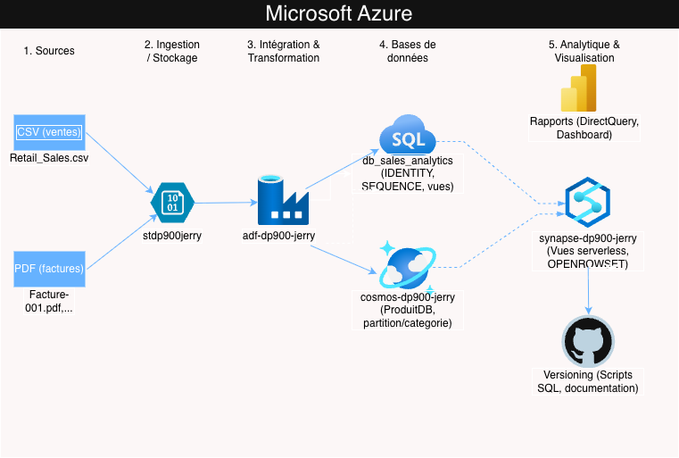

# Projet Azure – Analyse de ventes

## Objectif
Projet pratique pour la certification Microsoft Azure Data Fundamentals (DP‑900).  
Mise en place d'une plateforme de données de bout en bout (End-to-End) sur Azure.

## Structure du projet
- `data/` : données brutes et transformées
- `sql/` : scripts SQL (création, migration, requêtes)
- `docs/` : documentation détaillée et captures d'écran
- `powerbi/` : rapports Power BI (.pbix)

## Architecture technique

## Documentation détaillée
- [Guide de reproduction](docs/reproduction.md) – Étapes pour recréer le projet
- [Concepts DP-900 couverts](docs/dp-900-concepts.md) – Lien avec la certification
- [Scripts SQL](sql/) – Tous les scripts versionnés
- [Captures d'écran](docs/images/) – Visualisations du projet

## Technologies utilisées
- Azure SQL Database
- Azure Blob Storage
- Azure Cosmos DB
- Azure Data Factory
- Azure Synapse Analytics
- Power BI

## Domaines DP-900 couverts
- [x] Données relationnelles
- [x] Données non-relationnelles
- [x] ETL & Intégration
- [x] Analytique & Visualisation

## Auteur
[Jerry Heritiana](https://github.com/JerryHeritian) – Projet dans le cadre de la préparation DP-900