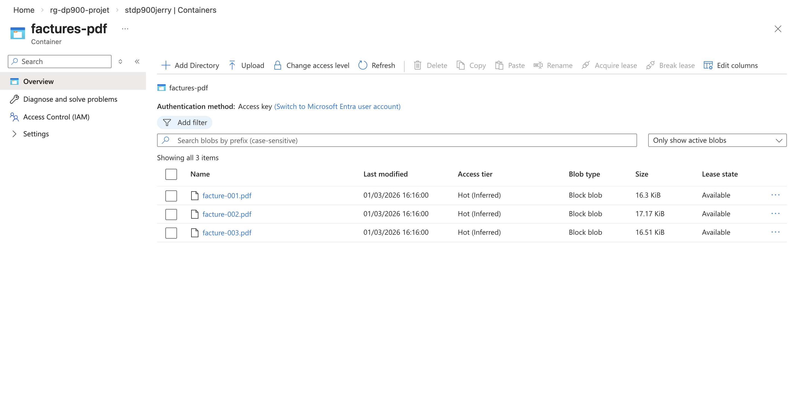
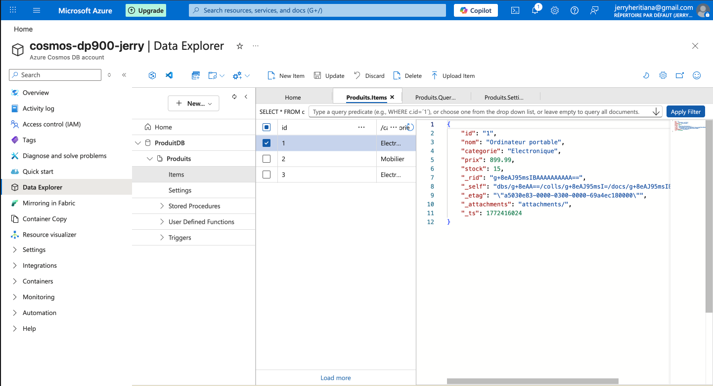

# Projet Azure – Analyse de ventes

## Objectif
Projet pratique pour les bases du Data

## Structure
- `data/raw` : données brutes (CSV)
- `data/processed` : données transformées
- `sql` : scripts SQL
- `notebooks` : exploration (Python / Jupyter)
- `docs` : documentation et captures d’écran

## Architecture technique

### Stockage des données
- `Azure SQL Database` : Données transactionnelles (ventes)
- `Azure Blob Storage` : Fichiers non structurés (factures PDF)
- `Azure Cosmos DB` : Catalogue produits flexible (NoSQL)

### Pipeline de données
- `Ingestion` : Fichiers CSV → Azure SQL (via scripts SQL)
- `Stockage` : PDF → Blob Storage (upload manuel)
- `Requêtage` : Interrogation des données avec SQL (SQL Database et Cosmos DB)

### Sécurité
- Accès privé aux conteneurs Blob
- SAS tokens pour accès temporaire sécurisé
- Authentification SQL pour les bases de données

### Captures d'écran

`Blob Storage` : Conteneur avec PDF

`Cosmos DB` : Arborescence

`SAS Token` : Génération
.png)
