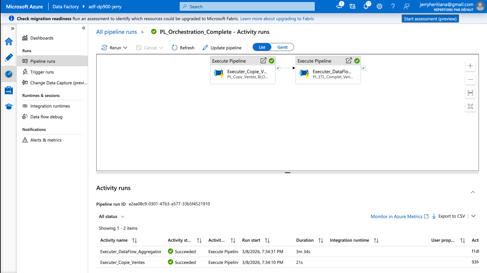

# Projet Azure – Analyse de ventes

## Objectif
Projet pratique pour la certification Microsoft Azure Data Fundamentals (DP‑900).  
Mise en place d'une plateforme de données de bout en bout (End-to-End) sur Azure : stockage relationnel, non-relationnel, ETL et analytique.

## Structure
- `data/raw` : données brutes (CSV)
- `data/processed` : données transformées
- `sql` : scripts SQL (création, migration, requêtes)
- `notebooks` : exploration (Python / Jupyter)
- `docs` : documentation et captures d’écran

---

## 🏗️ Architecture technique

### Stockage des données
- **`Azure SQL Database`** : Données transactionnelles (ventes)
- **`Azure Blob Storage`** : Fichiers non structurés (factures PDF)
- **`Azure Cosmos DB`** : Catalogue produits flexible (NoSQL)

### Pipeline de données
- **`Ingestion`** : Fichiers CSV → Azure SQL (via pipeline Azure Data Factory)
- **`Stockage`** : PDF → Blob Storage (upload manuel)
- **`Requêtage`** : Interrogation des données avec SQL (SQL Database et Cosmos DB)
- **`Orchestration`** : Azure Data Factory pour automatiser les flux ETL

### Sécurité
- Accès privé aux conteneurs Blob
- SAS tokens pour accès temporaire sécurisé
- Authentification SQL pour les bases de données
- Pare-feu Azure SQL avec règles IP

---

## 🗃️ Évolution de la base de données (migration finale)

Nous avons modernisé la table `ventes` avec une architecture professionnelle :

| Aspect | Avant | Après |
|--------|-------|-------|
| **`transaction_id`** | VARCHAR avec préfixe (`tr_00001`) | **`INT IDENTITY`** (auto-incrémenté) |
| **`customer_id`** | VARCHAR avec préfixe (`cu_01000`) | **`INT`** avec **`SEQUENCE`** (démarre à 1000) |
| **Affichage** | Direct dans la table | Via vue **`ventes_presentation`** |
| **Performance** | Moyenne (VARCHAR) | Optimale (index sur INT) |
| **Pipeline ADF** | Complexe (9 mappings) | Simplifié (7 mappings) |

### Structure actuelle

#### Table `ventes` (stockage physique - utilisée par ADF)
```sql
transaction_id INT IDENTITY(1,1) PRIMARY KEY,
customer_id INT DEFAULT (NEXT VALUE FOR customer_seq),
date DATE NOT NULL,
gender VARCHAR(10),
age INT,
product_category VARCHAR(50),
quantity INT,
price_per_unit DECIMAL(10,2),
total_amount DECIMAL(10,2)

### Data Flow - Agrégation des ventes

- **`Source`** : Lecture de la table `ventes` via `DS_Ventes_SQL_v2`
- **`Select`** : Garde les colonnes `date`, `product_category`, `quantity`, `total_amount`
- **`Derived Column`** : Crée `annee` = year(`date`) et `mois` = month(`date`)
- **`Aggregate`** : Group by `annee`, `mois`, `product_category` avec :
  - **`total_ventes`** = count()
  - **`ca_total`** = sum(`total_amount`)
  - **`prix_moyen`** = avg(`total_amount` / `quantity`)
- **`Sink`** : Écriture dans la table `ventes_agregees` via `DS_Ventes_Aggregated`

### Table de destination
```sql
CREATE TABLE ventes_agregees (
    id INT IDENTITY(1,1) PRIMARY KEY,
    annee INT NOT NULL,
    mois INT NOT NULL,
    product_category VARCHAR(50) NOT NULL,
    total_ventes INT NOT NULL,
    ca_total DECIMAL(12,2) NOT NULL,
    prix_moyen DECIMAL(10,2) NOT NULL,
    date_calcul DATE DEFAULT GETDATE()
); ```

### Orchestration

*Exécution réussie du pipeline d'orchestration avec les deux activités enchaînées*
